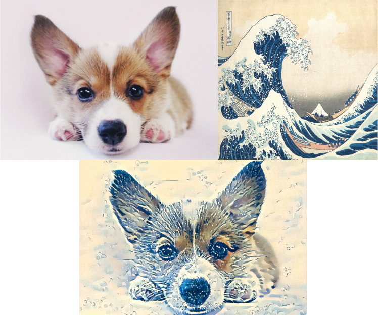

DEEP Open Catalogue: Neural Transfer
==============================

[](https://jenkins.indigo-datacloud.eu/job/Pipeline-as-code/job/DEEP-OC-org/job/neural_transfer/job/master)

**Author:** [Silke Donayre](https://github.com/SilkeDH) (KIT)

**Project:** This work is part of the [DEEP Hybrid-DataCloud](https://deep-hybrid-datacloud.eu/) project that has received funding from the European Union’s Horizon 2020 research and innovation programme under grant agreement No 777435.

This is an example of how to perform neural transfer. This module allows you to take the content of an image and reproduce it with a new artistic style using the style of a different image. The code is based on the [Neural transfer Pytorch example](https://pytorch.org/tutorials/advanced/neural_style_tutorial.html) that implements the [Neural-Style algorithm](https://arxiv.org/abs/1508.06576) developed by Leon A. Gatys, Alexander S. Ecker and Matthias Bethge. This module returns either the new styled image or a pdf containing the two input images and the result image.

<p align="center">

</p>

Another example applied to a real image is given below:

<p align="center">

</p>

**Table of contents**
1. [Installing this module](#installing-this-module)
    1. [Local installation](#local-installation)
    2. [Docker installation](#docker-installation)
2. [Predict/Transfer](#predict)
3. [Acknowledgements](#acknowledgments)

## Installing this module

### Local installation

> **Requirements**
>
> This project has been tested in Ubuntu 18.04 with Python 3.7.4. Further package requirements are described in the
> `requirements.txt` file.
> - It is a requirement to have [torch>=1.4.0 and torchvision>=0.5.0 installed](https://pytorch.org/get-started/locally/). 

To start using this framework clone the repo:

```bash
git clone https://github.com/deephdc/neural_transfer
cd neural_transfer
pip install -e .
```
now run DEEPaaS:
```
deepaas-run --listen-ip 0.0.0.0
```
and open http://0.0.0.0:5000/ui and look for the methods belonging to the `neural_transfer` module.

### Docker installation

We have also prepared a ready-to-use [Docker container](https://github.com/deephdc/DEEP-OC-neural_transfer) to
run this module. To run it:

```bash
docker search deephdc
docker run -ti -p 5000:5000 -p 6006:6006 -p 8888:8888 deephdc/deep-oc-neural_transfer
```

Now open http://0.0.0.0:5000/ui and look for the methods belonging to the `neural_transfer` module.


You can find more information about it in the [DEEP Marketplace](https://marketplace.deep-hybrid-datacloud.eu/modules/deep-oc-neural_transfer.html).

## Predict/Transfer

Go to http://0.0.0.0:5000/ui and look for the `PREDICT` POST method. Click on 'Try it out', change whatever test args
you want and click 'Execute'. There you must supply two different images, one containing the style and the other, the content. If you do not have any images where you can get the style, you can choose one in the `style` argument that we provide.


## Acknowledgements

The original code, etc. were created by Pytorch and can be found [here](https://github.com/pytorch/tutorials/blob/master/advanced_source/neural_style_tutorial.py).

If you consider this project to be useful, please consider citing the DEEP Hybrid DataCloud project:

> García, Álvaro López, et al. [A Cloud-Based Framework for Machine Learning Workloads and Applications.](https://ieeexplore.ieee.org/abstract/document/8950411/authors) IEEE Access 8 (2020): 18681-18692. 

<p><small>Project based on the <a target="_blank" href="https://drivendata.github.io/cookiecutter-data-science/">cookiecutter data science project template</a>. #cookiecutterdatascience</small></p>
